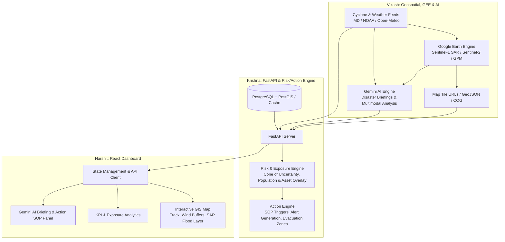

# 🌪️ Cyclone Risk Assessment & Action Engine: Implementation Plan

A comprehensive technical blueprint, architecture specification, and task breakdown for building a full-stack Cyclone Tracking, Geospatial Analysis, AI-driven Risk Assessment, and Disaster Response Action Dashboard.

---

## 👥 Team Work Division Overview

| Team Member | Role | Core Focus Areas |
| :--- | :--- | :--- |
| **Vikash** | **Geospatial, Data & AI Engineer** | Cyclone & weather feeds, Satellite data, Google Earth Engine (GEE) processing pipelines, Gemini AI prompt orchestration & multimodal analysis. |
| **Krishna** | **Backend & Risk Engine Architect** | FastAPI backend architecture, Database/PostGIS, Risk/Exposure calculation engine, Action generation pipeline, API orchestration. |
| **Harshit** | **Frontend & Geospatial UI Engineer** | React dashboard, Interactive Mapbox/Deck.gl GIS visualization, Live layer switchers, AI advisory panels, KPI charts & Action checklists. |

---



---

## 🛠️ Detailed Implementation Plan by Team Member

---

### 🧑‍💻 Person 1: Vikash (Data, Earth Engine & Gemini AI)

#### 1. Cyclone & Weather Data Ingestion Pipeline
- **Data Sources**:
  - **Cyclone Real-Time & Historical Tracks**: Integrate IMD (India Meteorological Department) RSS/APIs, NOAA NHC / IBTrACS / GDACS live cyclone tracking GeoJSON/CSV feeds.
  - **Live & Forecast Weather**: Open-Meteo Marine/Wind APIs, GFS / ECMWF wind speed, sea surface temperature (SST), and atmospheric pressure.
- **Deliverables**:
  - Python ingestion scripts providing standardized models: `CyclonePoint(lat, lon, timestamp, wind_speed, pressure, category, forecast_cone)`.
  - Automated cron/polling service for active tropical cyclone advisories.

#### 2. Google Earth Engine (GEE) Processing Engine
- **Setup & Auth**: Service account integration with GEE Python API (`earthengine-api`, `geemap`).
- **Earth Observation Tasks**:
  - **Flood/Inundation Mapping**: Sentinel-1 SAR GRD backscatter change detection (before vs. during/after storm) for cloud-penetrating water extent.
  - **Precipitation Accumulation**: NASA GPM (Global Precipitation Measurement) IMERG 3-hourly/daily rainfall estimates.
  - **Storm Imagery & Vegetation Impact**: Sentinel-2 (optical cloud-masked) and MODIS/Himawari cloud top brightness temperature.
- **Export / Tile Generation**:
  - Generate GEE XYZ Tile Map URLs (`ee.Map.getTileUrl`) or Cloud Optimized GeoTIFFs (COG) to pass directly to Harshit's React Map.
  - Pre-calculated raster zonal statistics (e.g., total flooded area in $\text{km}^2$ per administrative boundary).

#### 3. Gemini AI Multimodal Reasoning Engine
- **Prompt Engineering & Structured Outputs**:
  - Ingest structured storm parameters + exposure data from Krishna's engine to output structured JSON:
    - *Executive Situation Summary*
    - *High-risk District Priorities*
    - *Infrastructure Impact Warnings (Power, Roads, Medical)*
    - *Recommended Humanitarian & Evacuation SOPs*
- **Multimodal Visual Analysis**:
  - Feed processed satellite thumbnails/flood masks to Gemini Flash for rapid visual damage assessment and visual summary descriptions.

---

### 🧑‍💻 Person 2: Krishna (FastAPI Backend, Risk & Action Engine)

#### 1. FastAPI Core Architecture & Data Orchestration
- **Framework & Structure**:
  - Modular FastAPI app layout (`app/api/v1/endpoints/`, `app/models/`, `app/services/`, `app/core/config.py`).
  - CORS, Rate limiting, Pydantic v2 schemas for all incoming/outgoing payloads.
  - Database layer: SQLAlchemy / Tortoise ORM with PostgreSQL + PostGIS (or SpatiaLite for rapid prototyping) to store spatial geometries of administrative boundaries, critical infrastructure, and cyclone tracks.
  - Redis cache for GEE Tile URLs and live weather polling to minimize external latency.

#### 2. Risk & Exposure Engine
- **Spatial Intersect Calculations**:
  - Buffer generation around cyclone trajectory (34-knot, 50-knot, 64-knot wind radii and forecast cone).
  - Spatial intersection query: Overlay cyclone buffer and GEE flood masks with district population databases, hospitals, power sub-stations, and major highways.
- **Multi-Hazard Composite Risk Score Algorithm**:
  $$\text{Risk Index} = w_1 \cdot \text{WindHazard} + w_2 \cdot \text{FloodDepth} + w_3 \cdot \text{StormSurge} + w_4 \cdot \text{VulnerabilityIndex}$$
  Categorize regions into **Low (Green)**, **Moderate (Yellow)**, **High (Orange)**, **Severe (Red)** risk tiers.

#### 3. Action Engine & Alert Dispatch
- **Rule-Based & AI-Assisted SOP Generator**:
  - Map risk tiers to emergency action triggers (e.g., Category 3 within 24h $\rightarrow$ Trigger coastal evacuation order, deploy NDRF/SDRF teams, activate emergency shelters).
  - Dynamic evacuation priority ranker based on hospital vulnerability and population density.
- **REST Endpoints & WebSocket Feeds**:
  - `GET /api/v1/cyclones/active`: Current active storms with trajectories & cones.
  - `GET /api/v1/geospatial/layers`: Active GEE tile URLs (Sentinel SAR flood, GPM rain, Wind particles).
  - `GET /api/v1/risk/exposure/{cyclone_id}`: District-level exposed population, affected hospitals, roads at risk.
  - `GET /api/v1/actions/recommendations/{cyclone_id}`: AI + Rule-based mitigation SOP checklist.
  - `GET /api/v1/ai/briefing/{cyclone_id}`: Real-time Gemini situation report.
  - `WS /api/v1/ws/alerts`: WebSocket channel for real-time alert broadcasts.

---

### 🧑‍💻 Person 3: Harshit (React Frontend & Interactive Dashboard)

#### 1. UI/UX Architecture & Layout
- **Tech Stack**: React (Vite) + JavaScript/JSX + Tailwind CSS + Lucide React + Radix UI / Headless components.
- **Dashboard Layout**:
  - **Top Bar**: Active Cyclone Selector, Landfall Countdown Timer, Threat Severity Badge, Last Synced timestamp.
  - **Main View (Split Screen)**: 70% Interactive GIS Map & 30% Dynamic Risk & Action Feed.
  - **Bottom Drawer / Collapsible Bar**: Timeline scrubber for cyclone forecast progression ($t-24\text{h}$ to $t+72\text{h}$).

#### 2. Interactive Geospatial Map Visualizations
- **Map Engine**: Mapbox GL JS / MapLibre GL / Deck.gl.
- **Layer Controls & Visualization**:
  - **Cyclone Track**: SVG/GeoJSON lines with past eye points (dots colored by intensity category) and forecast uncertainty cone polygon.
  - **Wind Radii**: Concentric animated buffer circles.
  - **Raster Layers Toggle**:
    - Sentinel-1 SAR flood extent overlay (with opacity slider).
    - GPM rainfall accumulation heatmap.
    - Live animated wind particle flow.
  - **Vector POI Overlay**: Hospitals (blue cross), shelters (green house), blocked roads (red dash) with interactive hover tooltips & click drawers.

#### 3. Risk Metrics, Gemini AI Feed & Action Center
- **Exposure Analytics**:
  - Stat cards: Exposed Population, Active Shelters, Estimated Economic Hazard.
  - Recharts bar/radar charts comparing district-wise vulnerability.
- **Gemini AI Situation Briefing Card**:
  - Streaming or markdown-rendered executive briefing generated by Gemini.
  - One-click PDF/Report export for emergency management officials.
- **Action SOP Checklist**:
  - Interactive triage table grouped by phase (*Pre-Landfall*, *Landfall*, *Post-Landfall Rescue*).
  - Status toggles (*Pending*, *In-Progress*, *Deployed*) with assigned personnel/department tags.

---

## 🔗 Interface & API Contract (Bridge between the 3 Members)

### Standardized Cyclone Data Schema (`/api/v1/cyclones/active`)
```json
{
  "cyclone_id": "CYC-2026-01",
  "name": "Cyclone Vardah-II",
  "category": 3,
  "max_sustained_wind_kmh": 165,
  "central_pressure_mb": 960,
  "current_position": { "lat": 14.5, "lon": 82.1, "recorded_at": "2026-09-21T18:00:00Z" },
  "forecast_track": [
    {
      "timestamp": "2026-09-22T06:00:00Z",
      "lat": 15.2,
      "lon": 81.4,
      "wind_kmh": 175,
      "uncertainty_radius_km": 45
    }
  ],
  "gee_layers": {
    "sar_flood_tile_url": "https://earthengine.googleapis.com/v1/projects/.../tiles/{z}/{x}/{y}",
    "rainfall_accum_tile_url": "https://earthengine.googleapis.com/v1/projects/.../tiles/{z}/{x}/{y}"
  }
}
```

### Risk & Action Engine Schema (`/api/v1/risk/exposure/CYC-2026-01`)
```json
{
  "cyclone_id": "CYC-2026-01",
  "total_population_at_risk": 1845000,
  "high_risk_districts": [
    {
      "district_name": "Nellore",
      "risk_score": 88.5,
      "risk_level": "RED",
      "flooded_area_sq_km": 142.3,
      "vulnerable_hospitals": 6,
      "shelters_available": 34
    }
  ],
  "gemini_advisory": {
    "executive_summary": "Intensifying Very Severe Cyclonic Storm approaching south Andhra coast with expected landfall within 18 hours...",
    "critical_actions": [
      {
        "priority": "HIGH",
        "phase": "PRE_LANDFALL",
        "target_sector": "Evacuation",
        "instruction": "Initiate mandatory evacuation within 5km coastal belt in Nellore & Prakasam districts."
      }
    ]
  }
}
```

---

## 📅 Step-by-Step Milestones & Integration Timeline

```mermaid
gantt
    title Cyclone Project 3-Person Milestone Roadmap
    dateFormat  YYYY-MM-DD
    section Setup & Foundations
    Repo setup, schemas & contract definition     :a1, 2026-09-22, 2d
    Vikash: GEE Auth & Cyclone data feed fetch   :v1, 2026-09-24, 4d
    Krishna: FastAPI skeleton & PostGIS setup    :k1, 2026-09-24, 4d
    Harshit: React + Mapbox base setup          :h1, 2026-09-24, 4d

    section Core Engine Development
    Vikash: SAR Flood mapping & Gemini prompt pipeline :v2, 2026-09-28, 5d
    Krishna: Risk calculation & Action Engine logic   :k2, 2026-09-28, 5d
    Harshit: Track, cone & GIS layer rendering        :h2, 2026-09-28, 5d

    section Integration & Polish
    End-to-end API & Tile Integration (All)           :m1, 2026-10-03, 4d
    Action checklist, Gemini UI & PDF export          :m2, 2026-10-07, 3d
    Load testing, mock live storm demo & verification :m3, 2026-10-10, 2d
```

---

## 🗂️ Project Directory Structure

```text
cylone_project/
├── IMPLEMENTATION_PLAN.md         # This full implementation specification
├── README.md                      # Project overview & quickstart
├── backend/                       # [Krishna's Workspace]
│   ├── app/
│   │   ├── api/v1/                # Endpoints (cyclones, risk, actions, ai)
│   │   ├── core/                  # Config, security, database connectors
│   │   ├── models/                # SQLAlchemy & Pydantic schemas
│   │   ├── services/
│   │   │   ├── risk_engine.py     # Spatial buffer & vulnerability calculations
│   │   │   ├── action_engine.py   # Disaster response SOP generation
│   │   │   └── data_bridge.py     # Connector to Vikash's GEE/Gemini modules
│   │   └── main.py
│   ├── Dockerfile
│   └── requirements.txt
├── geospatial_ai/                 # [Vikash's Workspace]
│   ├── data_ingestion/            # IMD/NOAA weather and track scrapers
│   ├── gee/
│   │   ├── auth.py                # GEE initialization
│   │   ├── sar_flood_detector.py  # Sentinel-1 flood change detection
│   │   └── gpm_rainfall.py        # GPM precipitation calculation
│   ├── gemini/
│   │   ├── advisory_prompts.py    # Structured prompting for Gemini Flash
│   │   └── multimodal_analyzer.py # Satellite image damage reasoning
│   └── requirements.txt
└── frontend/                      # [Harshit's Workspace]
    ├── src/
    │   ├── components/
    │   │   ├── map/               # Mapbox / Deck.gl container & layer controllers
    │   │   ├── dashboard/         # KPI Cards, Category Badges, Countdown
    │   │   ├── ai_advisory/       # Gemini situation reports & recommendations
    │   │   └── actions/           # Interactive SOP checklist & triage panel
    │   ├── hooks/                 # Custom React queries & WebSocket hooks
    │   ├── services/api.js        # Axios client for Krishna's endpoints
    │   └── App.jsx
    ├── package.json
    └── vite.config.js
```
